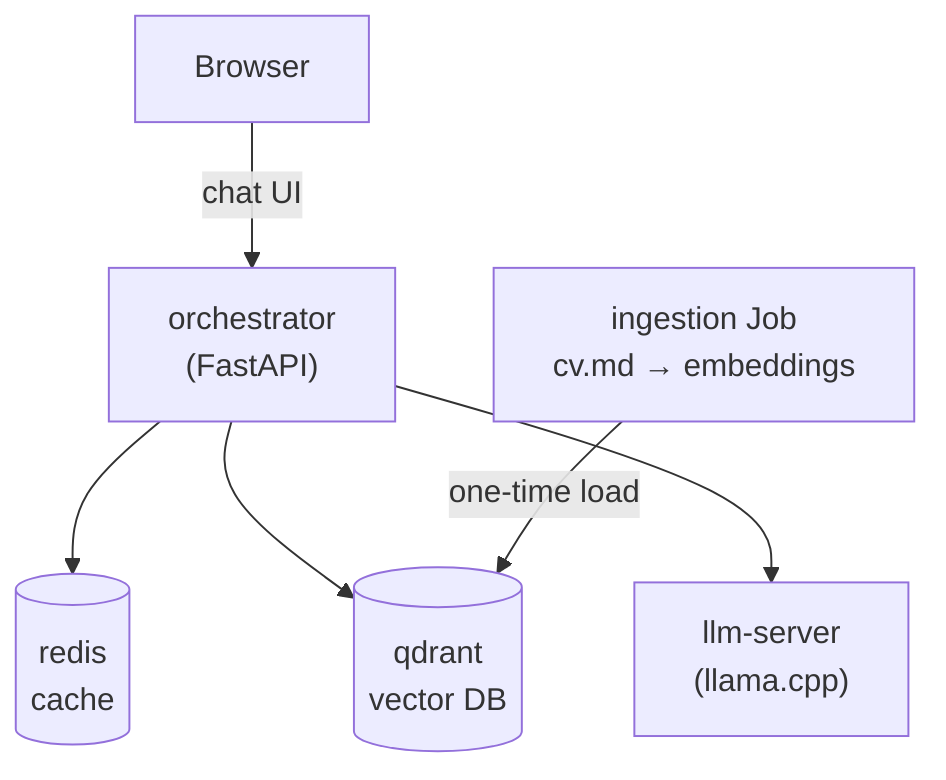

# CV RAG bot

A retrieval-augmented Q&A bot that answers questions about a CV, running on
Kubernetes with a built-in chat UI.

## Architecture



| Component | What it does |
|---|---|
| `ingestion` | Job. Chunks `cv.md` by `# Heading`, embeds with `bge-small-en-v1.5`, upserts into Qdrant. Rebuilds the collection every run. |
| `orchestrator` | FastAPI. `POST /ask`: cache check → embed question → retrieve top-3 chunks → prompt `llm-server` → cache → respond. Also serves the chat UI at `GET /`. |
| `qdrant` | Vector DB. Single-replica `StatefulSet` + PVC. |
| `redis` | Caches answers 7 days, keyed by normalized question hash. |
| `llm-server` | `llama.cpp` serving Qwen2.5-1.5B-Instruct (GGUF, Q4_K_M), single slot (`-np 1`) to keep the full 2048-token context for one request at a time. |

KEDA HTTP autoscaling is available but optional — see below.

## Quickstart

```bash
eval $(minikube docker-env)   # build straight into the cluster's daemon

docker build -t cv-rag-ingest:v1 ./ingestion
docker build -t cv-rag-orchestrator:v1 ./orchestrator
docker build -t cv-rag-llm:v1 ./llm

kubectl apply -f k8s/data-layer.yaml
kubectl wait --for=condition=ready pod -l app=qdrant -n cv-rag --timeout=120s

kubectl apply -f k8s/ingestion-job.yaml
kubectl wait --for=condition=complete job/cv-ingest -n cv-rag --timeout=120s

kubectl apply -f k8s/llm-server.yaml
kubectl apply -f k8s/orchestrator.yaml
kubectl wait --for=condition=ready pod -l app=orchestrator -n cv-rag --timeout=120s

kubectl port-forward -n cv-rag svc/orchestrator 8000:80
```

Open `http://localhost:8000` for the chat UI, or:

```bash
curl -X POST http://localhost:8000/ask \
  -H "Content-Type: application/json" \
  -d '{"question": "What is your experience with Kubernetes?"}'
```

Ask the same question twice — the second reply comes back `"cached": true`
and much faster. Cold answers on CPU-only hardware can take over a minute
(`orchestrator`'s LLM client timeout is set to 180s).

**Before building**: `ingestion/cv.md` is empty by default — add your CV
content there first, one `# Heading` per section (each heading becomes a
retrievable chunk). Using a real registry instead of the local daemon?
Update `image:` and drop `imagePullPolicy: Never` in `k8s/*.yaml`.

## Updating the CV

```bash
# edit ingestion/cv.md, rebuild cv-rag-ingest:v1, then:
kubectl delete job cv-ingest -n cv-rag   # Jobs are immutable
kubectl apply -f k8s/ingestion-job.yaml
```

## Optional: KEDA autoscaling

```bash
helm repo add kedacore https://kedacore.github.io/charts && helm repo update
kubectl create namespace keda
helm install keda kedacore/keda --namespace keda
helm install http-add-on kedacore/keda-add-ons-http --namespace keda \
  --set scaler.replicas=1 --set interceptor.replicas.min=1

kubectl apply -f k8s/http-scaledobject.yaml   # edit `hosts` to your domain first
```

Route your Ingress to the HTTP add-on's interceptor, not straight to
`orchestrator`.

## Repo structure

```
ingestion/    cv.md, ingest.py, Dockerfile        — embeds cv.md into Qdrant
orchestrator/ main.py, static/index.html, Dockerfile — RAG API + chat UI
llm/          Dockerfile                          — llama.cpp + GGUF model
k8s/          data-layer, ingestion-job, llm-server, orchestrator, http-scaledobject
```
